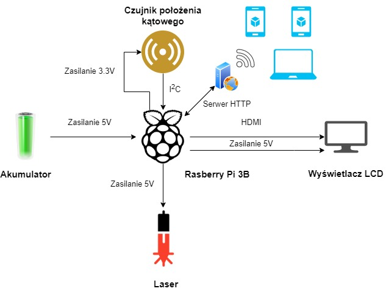
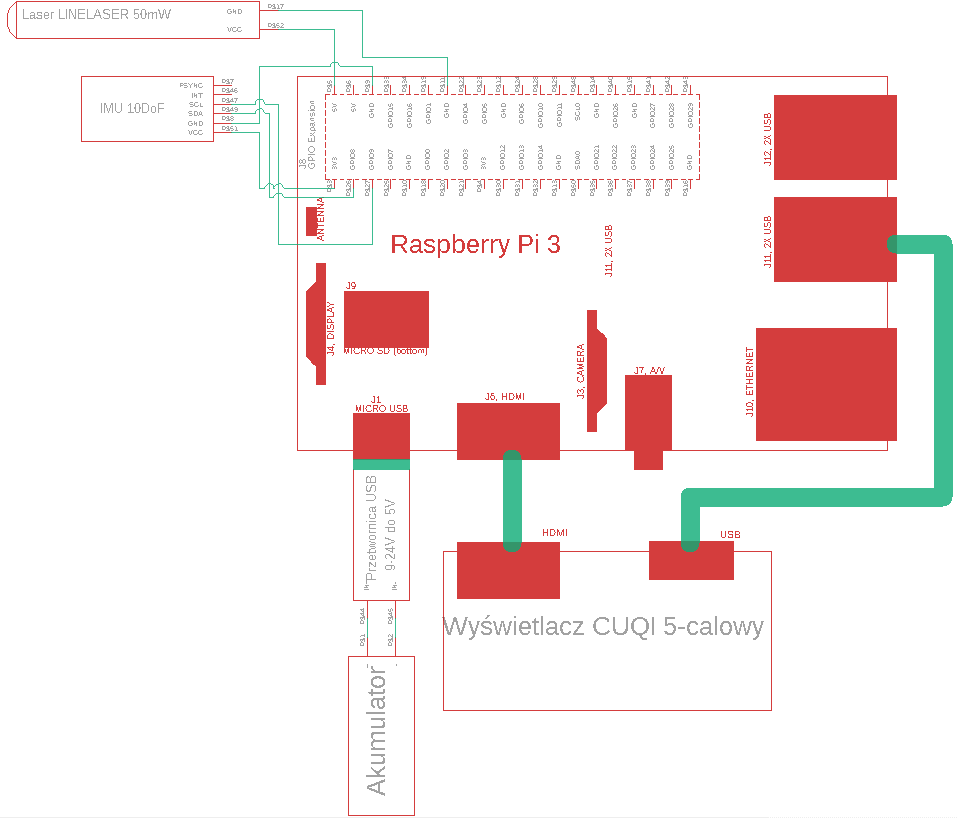
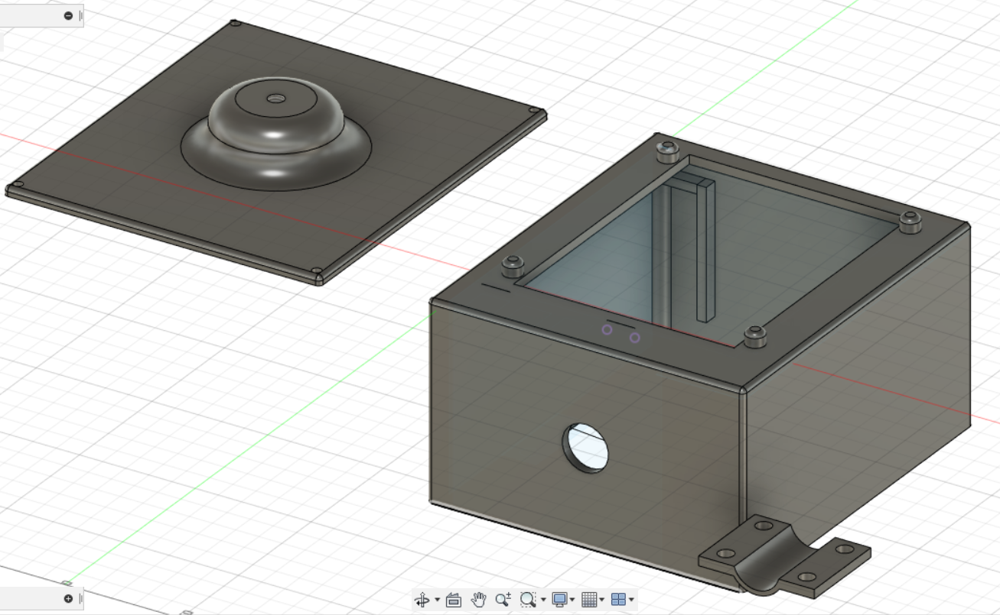
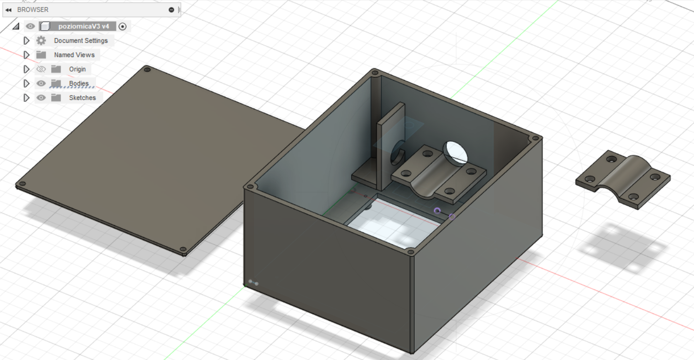
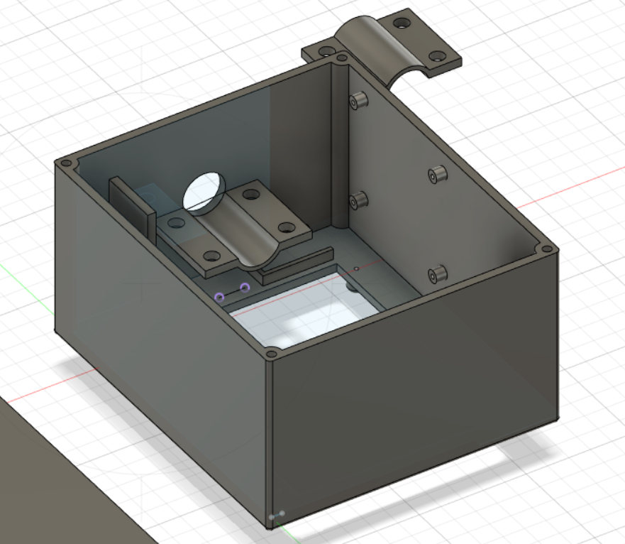

# Poziomica laserowa z cyfrowym odczytem kąta pochylenia
## Autorzy:
* Bartosz Ławrynowicz
* Miłosz Ziemba
* Paweł Urbański 
## 1. Cel projektu
Celem projektu jest stworzenie przenośnej poziomicy laserowej zarządzanej bezprzewodowo. Kluczowym elementem projektu jest zapewnienie komunikacji pomiędzy czujnikiem położenia kątowego oraz urządzeniem kontrolującym jego pracę. System powinien odczytywać pomiary w czasie rzeczywistym, a wszystkie jego elementy muszą stanowić integralną część. Końcowym zadaniem jest zaprojektowanie obudowy, która zabezpieczy wszystkie elementy systemu. 
## 2. Założenia projektowe
* Czujnik położenia kątowego umożliwia preceyzyjne ustawienie kątowe lasera.
* Czujnik powinien umożliwiać odczytanie wartości względnej i bezwględnej.
* System powinien umożliwić przesył danych pomiędzy czujnikiem a mikrokontrolerem lub dowolnej platformy komputerowej.
* Użytkownik systemu otrzymuje informację o aktualnej wartości przechyłu w czasie rzeczywistym. 
* Użytkownik ma możliwość zapisu oraz usunięcia dokonanych pomiarów.
* System umożliwia zdalną obsługę czujnika w tym jego konfigurację.
* Wyświetlanie i edycja pomiarów możliwa jest przy użyciu urządzeń mobilnych lub komputerów osobistych.
## 3. Wykorzystywane urządzenia 
* Laser krzyżowy LINELASER 50mW.
* Moduł sterujący systemem: Rasberry Pi 3 model B.
* Czujnik położenia kątowego: IMU 10DoF ( żyroskop, akcelerometr, magnetometr, barometr).
* Akumulator Li-Ion Titan 6000mAh 16C 6S.
* Wyświetlacz CUQI (5-calowy).
* Karta pamięci microSD 32 GB. 
## 4. Specyfikacja urządzeń 
## 5. Wykorzystywane technologie oraz protokoły
* Komunikacja czujnika z Rasberry Pi odbywa się przy użyciu protokołu **I2C**. 
* Skrypty obsługujące komunikację I2C napisane są w języku programowania **Python**.
* Interfejs użytkownika stworzony jest w formie aplikacji webowej.
* Rolę serwera WWW pełni Rasberry Pi.
* System wykorzystuje bazę danych **SQLite**.
* Aplikacja webowa stworzona została z wykorzystaniem frameworku **django**.
* Połączenie wyświetlacza z Rasberry Pi odbywa się za pomocą interfejsu **HDMI**.
* Rasberry Pi działa w formie acces point (punkt dostępu).
* Urządzenia mobilne łączą się z punktem dostępu za pomocą modułu **Wi-Fi**. 
## 6. Schemat połączenia elementów 

## 7. Schemat układu 

## Obudowa




### Urlpatterns
Urlspatterns to mapowanie ścieżek adresów url do odpoweidnich funkcji. Wpisanie określonego adresu url w okno przeglądarki spowoduje wywaołanie konkretnej funkcji opisanej w pliku `views.py`. Funkcje te nazywane są widokami i definiują odpowiedzi serwera www na akcję użytkownika.

```python
urlpatterns = [
    path('admin/', admin.site.urls),
    path('', views.home, name ='home'),
    path('go/', views.robPomiar, name="robPomiar"),
    path('go/<str:pomiar_wynik>', views.wynikPomiaru, name="wynikpomiaru"),
    path('liveview', views.liveView, name="liveview"),
    path('liveview/update', views.liveViewUpdate, name="liveviewUpdate")
]
```
Wpisanie adresu strony bez określonej ścieżki spowoduje wywołanie funkcji widoku `home`.

### Widok początkowy (home)

`render()` to popularny idiom do ładowania szablonu, wypełniania kontekstu i zwracania obiektu HttpResponse z wynikiem wyrenderowanego szablonu. W tym przypadku kontekstem jest przekazany do szablonu obiekt typu słownik (dictionary). Zawarte w nim dane to obiekty pobrane z modelu Pomiary, które odpowiadają rekordom w tabeli bazy danych. Obiektowe odniesienie do bazy danych jest możliwe dzięki ORM - mapowaniu obiektowo-relacyjnym. Jest to sposób odwzorowania obiektowej architektury systemu informatycznego na bazę danych. 
```
def home(request): #pomiary
    pomiary = Pomiary.objects.all()
    print(random_degrees())
    return render(request, 'poziomica_app/index.html', {'pomiary': pomiary})
```
Wygląd wyrenderowanego szablonu `index.html`. Szablonowy tag  generuje bezwzględny URL plików statycznych. Znacznik `<thead>` służy do grupowania treści nagłówka w tabeli HTML.


```html





<div class="d-flex justify-content-center mt-5 ">
    <table class="table">
        <thead>
          <tr>
            <th scope="col">#</th>
            <th scope="col">Nazwa</th>
            <th scope="col">Wynik</th>
            <th scope="col">Data</th>
          </tr>
        </thead>
        <tbody>
        
          <tr>
            <td>{{pomiar.id}}</td>
            <td>{{pomiar.nazwa}}</td>
            <td>{{pomiar.wynik}}</td>
            <td>{{pomiar.data}}</td>
          </tr>
        
        </tbody>
      </table>
</div>

```
